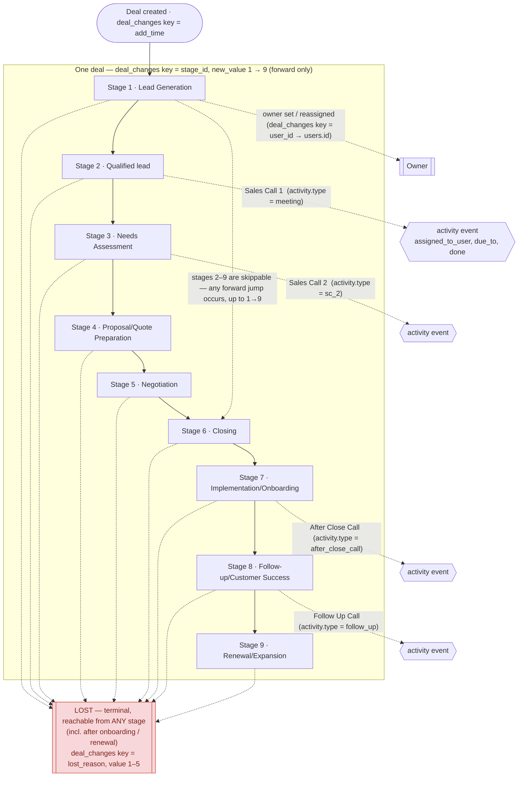
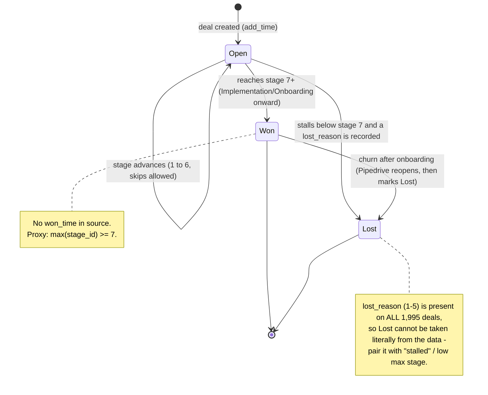

# Initial Exploratory Analysis — Pipedrive CRM Source Data

Analysis of the six raw Pipedrive extracts that land in the local Postgres
(`postgres` database, `public` schema) via `docker compose up`
(`init.sql` creates the tables, `raw_data/load_data.sh` `\COPY`s the CSVs in).

- **Profiled against:** local Postgres `public` schema, 2026-08-27.
- **Scope:** column-level dictionary, accepted values, CSV ↔ Postgres comparison,
  data-quality findings, and how the data maps onto the assessment sales funnel.

---

## 1. Pipedrive CRM glossary

Pipedrive is a sales CRM organised around **deals** moving through a **pipeline**.
Terms used by these tables:

| Term | Meaning in Pipedrive | Where it shows up here |
|---|---|---|
| **Deal** | A potential sale / opportunity. Has an owner, a stage, a value, an `add_time`, and a status (`open` / `won` / `lost`). | `deal_id` in `deal_changes` and `activity` |
| **Pipeline** | An ordered set of stages a deal travels through. | Implied — a single pipeline of 9 stages (`stages`) |
| **Stage** | A step in the pipeline (e.g. "Qualified lead"). Deals move stage-by-stage. | `stages`; `deal_changes.new_value` where `changed_field_key = 'stage_id'` |
| **Activity** | A scheduled task tied to a deal/person: call, meeting, email, follow-up. Has a type, an assignee, a due date, and a done flag. | `activity` |
| **Activity type** | Configurable catalogue of activity kinds. Each has a `key_string` (machine key) and an icon/label. | `activity_types` |
| **User** | A Pipedrive seat — a sales rep who owns deals and is assigned activities. | `users`; `activity.assigned_to_user`; `deal_changes` owner changes |
| **Deal field** | A deal attribute, standard or custom. Enum ("single option") fields carry an id→label option set. | `fields` |
| **Change log** | Pipeline of audit rows: "field X on deal Y became Z at time T". | `deal_changes` |
| **`add_time`** | Standard deal field = the timestamp the deal was created. | `fields` id 13; `deal_changes` key `add_time` |
| **Owner (`user_id`)** | Standard deal field = the user who owns the deal. | `fields` id 3; `deal_changes` key `user_id` |
| **Lost reason** | Free/enum text captured when a deal is marked **lost**. | `fields` id 23; `deal_changes` key `lost_reason` |
| **`done`** | Whether an activity has been completed (`0/1` in the API; `True/False` here). | `activity.done` |

### 1.1 Deal lifecycle — the 9 stages and the activity done in each

A single deal enters at **Stage 1** (the only mandatory stage) and moves
*forward* through the pipeline, emitting a `deal_changes` row on every
transition. Progression is monotonic but **not step-by-step**: 84 % of deals
skip one or more of stages 2–9 (see the diagram notes below). **Lost is a terminal outcome that can
be reached from any stage.** The catalogue in `activity_types` has four activity
kinds, each tied to a point in that lifecycle:



**Diagram notes — stages start at 1, move forward, and are very often skipped**

- First `stage_id` change for all 1 995 deals is `'1'` (Lead Generation), so
  **Stage 1 is the only mandatory stage**.
- Of the 6 913 stage-to-stage transitions: **6 901 forward, 2 no-change,
  8 backward**. Progression is effectively monotonic — the 8 backward moves
  (`3→1`, `3→2`, `4→2`, `6→1`, `7→1`, `8→1`, `8→3`, `8→6`, one each) look like
  manual corrections / noise and can be ignored.
- **Stages 2–9 are all skippable — and usually skipped.** Only **311 of 1 995
  deals (16 %)** touch every stage from 1 up to their maximum; the other
  **1 684 (84 %)** jump over at least one stage. Every forward jump size occurs,
  from `+1` up to the full `1→9` (seen once). The pipeline is not gated: a deal
  can move from any stage directly to any later stage. Real per-deal histories:
  `1 → 3 → 4 → 6 → 7`, `1 → 4 → 5`, `1 → 2 → 4 → 9`.
- Implication for the funnel model: "reached stage N" **cannot** be counted from
  a literal `new_value = 'N'` row — a deal that jumped `1→3` never has a `'2'`
  row but has still passed Qualified Lead. Use `max(new_value::int) >= N` per
  deal instead.

| Stage | `stage_id` | Activity to perform | `activity.type` | `activity_types.name` | Funnel step (README) |
|---|---:|---|---|---|---|
| Lead Generation | 1 | — (lead captured; owner assigned via `user_id`) | — | — | Step 1 |
| Qualified lead | 2 | **Sales Call 1** | `meeting` | Sales Call 1 | Step 2 / 2.1 |
| Needs Assessment | 3 | **Sales Call 2** | `sc_2` | Sales Call 2 | Step 3 / 3.1 |
| Proposal/Quote Preparation | 4 | — (build quote) | — | — | Step 4 |
| Negotiation | 5 | — (align on terms) | — | — | Step 5 |
| Closing | 6 | — (deal won/lost) | — | — | Step 6 |
| Implementation/Onboarding | 7 | **After Close Call** | `after_close_call` | After Close Call | Step 7 |
| Follow-up/Customer Success | 8 | **Follow Up Call** | `follow_up` (`active = 'No'`) | Follow Up Call | Step 8 |
| Renewal/Expansion | 9 | — (renewal / upsell) | — | — | Step 9 |

> **Data caveats:**
> - *(§5.2)* The diagram shows the *intended* CRM design. In this dataset the
>   `activity` rows and the `deal_changes` rows belong to almost completely
>   different deals (only 8 `deal_id`s overlap), so a real deal's activities
>   cannot be joined to its stage history via `deal_id`.
> - *(§5.3)* Every one of the 1 995 deals carries a `lost_reason` row, even deals
>   that reached Stage 9. In this synthetic data "Lost" is effectively universal
>   rather than a discriminating outcome — there is no `status` / `won` field to
>   tell won from lost.
> - **A deal can be lost after onboarding.** All 1 081 deals that reached Stage 7
>   (Implementation/Onboarding) or later have a `lost_reason` row, stamped *after*
>   their final stage change (1 077 / 1 081) — including the 324 that reached
>   Stage 9. In Pipedrive terms a deal can be marked Lost at any time while it is
>   *open*; a *won* deal would be reopened first and then lost. This source has no
>   `status` / `won_time` / `lost_time`, so "open / won / lost" below is **inferred**,
>   not read from a column.

### 1.2 Deal status (open / won / lost) — inferred, not stored

Pipedrive deals always carry a `status` of `open`, `won` or `lost` (with
`won_time` / `lost_time`). **None of those columns exist in this extract.** The
state machine below is how status *would* be reconstructed from what is available
(`stage_id` progression + the `lost_reason` row):



---

## 2. Source overview

| Table | Grain | Rows | Natural key | Notes |
|---|---|---:|---|---|
| `users` | one CRM user | 1 787 | `id` | Sales reps / deal owners |
| `stages` | one pipeline stage | 9 | `stage_id` | The 9 funnel steps, ordered |
| `activity_types` | one activity-type config row | 4 | `id` (also `type`) | Catalogue only |
| `fields` | one tracked deal field | 4 | `id` (also `field_key`) | Metadata + enum option sets |
| `activity` | one activity event | 4 579 | *(none reliable — see §5)* | `activity_id` has 11 collisions |
| `deal_changes` | one logged field change on one deal | 15 406 | *(none — event log)* | 1 995 distinct deals |

**Relationships**

```
users.id ─┬─< activity.assigned_to_user        (1 650 distinct users, 0 orphans)
          └─< deal_changes.new_value            (key = 'user_id'; 1 347 distinct, 0 orphans)

stages.stage_id ──< deal_changes.new_value      (key = 'stage_id'; values '1'..'9')

activity_types.type ──< activity.type           (4 types, 0 orphans)

fields.field_key ──< deal_changes.changed_field_key   (4 keys, exact match)

deal_id : activity  ⇄  deal_changes             ⚠ only 8 deals in common (see §5)
```

There is no `deals` table. A deal's current state must be **reconstructed** from
`deal_changes` (latest `stage_id`, latest `user_id`, the `add_time` row, and the
`lost_reason` row).

---

## 3. CSV ↔ Postgres comparison

Load path: `init.sql` (DDL) → `load_data.sh` runs
`\COPY <table> FROM '<file>.csv' DELIMITER ',' CSV HEADER` for every file in
`raw_data/`.

**Verification method:** every row of every CSV was read and canonicalised
(ints parsed, timestamps parsed with the `T`/space separator normalised,
`True/False` → boolean, `field_value_options` JSON re-serialised key-sorted,
`''` → `NULL`) and multiset-compared against the same canonicalisation of the
Postgres table. This is a full row-by-row content diff, not just a row-count
check.

| File | CSV rows | Postgres rows | Rows only in CSV | Rows only in DB | Content identical | Type coercions on load |
|---|---:|---:|---:|---:|:--:|---|
| `users.csv` | 1 787 | 1 787 | 0 | 0 | ✅ | `modified` text → `timestamp` (microsecond precision preserved) |
| `stages.csv` | 9 | 9 | 0 | 0 | ✅ | — |
| `activity_types.csv` | 4 | 4 | 0 | 0 | ✅ | `active` kept as text `'Yes'/'No'` (**not** boolean) |
| `fields.csv` | 4 | 4 | 0 | 0 | ✅ | `FIELD_VALUE_OPTIONS` text → `jsonb`; empty string → SQL `NULL` (2 rows) |
| `activity.csv` | 4 579 | 4 579 | 0 | 0 | ✅ | `done` text `'True'/'False'` → `boolean`; `due_to` → `timestamp` |
| `deal_changes.csv` | 15 406 | 15 406 | 0 | 0 | ✅ | `change_time` → `timestamp`; `new_value` stays `varchar(255)` for all field kinds |

**Findings**

1. **No data loss and no data change.** For all 6 tables the CSV and Postgres
   row sets are identical after type canonicalisation — 0 rows present on only
   one side, 0 value mismatches. `\COPY` rejected nothing and altered nothing
   beyond the declared type coercions.
2. **Header case.** `fields.csv` ships upper-case headers
   (`ID,FIELD_KEY,NAME,FIELD_VALUE_OPTIONS`); Postgres folds unquoted identifiers
   to lower-case, so the columns are `id, field_key, name, field_value_options`.
   All other files already use lower-case headers.
3. **Primary keys that held.** `users.id`, `stages.stage_id`,
   `activity_types.id`, `fields.id` are declared `PRIMARY KEY` in `init.sql` and
   loaded without error → they are genuinely unique in the source.
4. **No PK on the event tables.** `activity` and `deal_changes` have no
   constraints in `init.sql`. `activity_id` is **not** unique in practice
   (§5.1); `deal_changes` is a pure append log with no single-column key.
5. **`fields.field_value_options`** parses as a JSON array of `{"id","label"}`
   objects for `stage_id` and `lost_reason`; NULL for `add_time` and `user_id`.
6. **`new_value` is polymorphic text.** `varchar(255)` holds stage ids (`'1'`),
   user ids (`'1463'`), ISO-8601 timestamps (`'2024-04-09T21:32:09'`) and
   lost-reason ids (`'3'`) depending on `changed_field_key`. No truncation
   observed (longest value ≈ 19 chars).
7. **The sources are stale — a freshness test is added anyway.** This is a
   one-off static CSV snapshot: the newest record anywhere is
   `deal_changes.change_time` = 2025-03-11 (`users.modified` ends 2024-10-28,
   `activity.due_to` ends 2024-09-13), i.e. well over a year old. So
   `dbt source freshness` will report **STALE / error** every run today. A
   `freshness` block is still declared on the `pipedrive` source so the check is
   already wired and its thresholds (see §3.1) become meaningful the moment these
   tables are repointed at a live Pipedrive feed. It is not run by `dbt build` /
   `dbt test`, only by the explicit `dbt source freshness` command, so it does
   not block normal runs.

### 3.1 Freshness thresholds — derived from historical timestamp cadence

To size `warn_after` / `error_after` sensibly, the historical spacing of each
timestamp column was measured (gap between consecutive values, sorted):

| Source column | History span | Rows/day | Median gap | p95 gap | p99 gap | Max gap | Days w/ 0 rows |
|---|--:|--:|--:|--:|--:|--:|--:|
| `deal_changes.change_time` | 436 d | 35 | 20 min | 1.9 h | 5.1 h | ~266 h* | 28* |
| `users.modified` | 300 d | 6 | 2.8 h | 11.8 h | 19.5 h | 35.6 h | 0 |
| `activity.due_to` (proxy) | 257 d | 18 | 0.9 h | 4.0 h | 6.3 h | 9.6 h | 0 |

\* The 266 h (~11-day) max gap and the 28 zero-row days for `deal_changes` are
the extract **trailing off** at the end (Feb–Mar 2025). Inside the active period
the p99 gap holds ~5 h. Thresholds are sized to normal operation, not the
trail-off. There is **no weekday/weekend dip** (36–40 changes every day of the
week), so no `filter` / business-day carve-out is needed.

**Rule of thumb used:** `warn_after ≈ 2 × p99 gap`, `error_after ≈ 4 × p99 gap`
(and always above the observed max gap for low-volume tables).

| Table | `loaded_at_field` | `warn_after` | `error_after` | Basis |
|---|---|--:|--:|---|
| `deal_changes` | `change_time` | 12 h | 24 h | ~2× / ~4× the ~5 h p99 gap; far above any real-operation gap |
| `users` | `modified` | 24 h | 48 h | above the 35.6 h observed max gap, with margin (~2× / ~4× p99) |
| `activity` | `due_to` *(interim)* | 12 h | 24 h | ~2× / ~4× the 6.3 h p99 — but `due_to` is a *scheduled* date, not an ingest time, so this only works as a rough proxy |
| `stages`, `activity_types`, `fields` | *none available* | 26 h | 50 h | config tables have **no** data cadence to measure (loaded once, 4–9 rows); freshness here should track the **sync job**, not data change — assuming a daily sync, ~1× / ~2× the interval plus slack |

**In an ideal-case scenario, what I would want** is for the loader to stamp a
`_loaded_at` / `_synced_at` column on every table at ingest. Then `loaded_at_field`
is uniform across all six sources, and freshness on the slowly-changing config
tables measures "did the ingestion run on schedule" (the thing you actually care
about) rather than "did someone edit the pipeline". Given the data as it stands,
`stages`, `activity_types` and `fields` keep `freshness: null` because freshness
is not computable without a timestamp, and `activity` uses `due_to` as a stopgap.

---

## 4. Column dictionary

### 4.1 `users` — CRM users / deal owners

Grain: one row per user. 1 787 rows.

| Column | Type | Null? | Description | Values / range |
|---|---|:--:|---|---|
| `id` | integer | no | Pipedrive user id. Primary key. | 1 – 1 787, contiguous, unique |
| `name` | varchar(255) | no | Full name. | 1 766 distinct (a few real-name collisions, e.g. "Paul Williams" ×2) |
| `email` | varchar(255) | no | Login / contact email. | 1 783 distinct — **4 emails shared by 2 users each** (§5.4) |
| `modified` | timestamp | no | Last time the user record was updated. | 2024-01-02 01:44 → 2024-10-28 04:27. No creation timestamp exists. |

### 4.2 `stages` — pipeline stages

Grain: one row per stage. 9 rows. This is the funnel.

| Column | Type | Null? | Description | Values |
|---|---|:--:|---|---|
| `stage_id` | integer | no | Ordered position in the pipeline. Primary key. | `1`–`9` |
| `stage_name` | varchar(255) | no | Stage label. | see table below |

| `stage_id` | `stage_name` | Assessment funnel step |
|---:|---|---|
| 1 | Lead Generation | Step 1 |
| 2 | Qualified lead | Step 2 — Qualified Lead |
| 3 | Needs Assessment | Step 3 |
| 4 | Proposal/Quote Preparation | Step 4 |
| 5 | Negotiation | Step 5 |
| 6 | Closing | Step 6 |
| 7 | Implementation/Onboarding | Step 7 |
| 8 | Follow-up/Customer Success | Step 8 |
| 9 | Renewal/Expansion | Step 9 |

> Note: `stages.stage_name` = "Qualified lead" (lower-case *l*), whereas
> `fields.field_value_options` labels it "Qualified Lead". Two reference sources,
> one casing inconsistency.

### 4.3 `activity_types` — activity-type catalogue

Grain: one row per configured type. 4 rows.

| Column | Type | Null? | Description | Values |
|---|---|:--:|---|---|
| `id` | integer | no | Activity-type id. Primary key. | `1`–`4` |
| `name` | varchar(255) | no | Human label shown in the UI. | `Sales Call 1`, `Sales Call 2`, `Follow Up Call`, `After Close Call` |
| `active` | varchar(10) | no | Whether the type is enabled in Pipedrive. **Text, not boolean.** | `Yes` (3), `No` (1) |
| `type` | varchar(50) | no | Machine key (`key_string`) that `activity.type` joins to. | `meeting`, `sc_2`, `follow_up`, `after_close_call` |

| `name` | `type` | `active` | Maps to funnel sub-step |
|---|---|---|---|
| Sales Call 1 | `meeting` | Yes | Step 2.1 — Sales Call 1 |
| Sales Call 2 | `sc_2` | Yes | Step 3.1 — Sales Call 2 |
| Follow Up Call | `follow_up` | No | Step 8 — Follow-up (type is disabled but data still exists) |
| After Close Call | `after_close_call` | Yes | Step 8 / post-sale |

### 4.4 `fields` — tracked deal-field metadata

Grain: one row per deal field that appears in `deal_changes`. 4 rows.
This is Pipedrive's `dealFields` metadata slice.

| Column | Type | Null? | Description | Values |
|---|---|:--:|---|---|
| `id` | integer | no | Field id. Primary key. | `3`, `10`, `13`, `23` |
| `field_key` | varchar(50) | no | API key; joins to `deal_changes.changed_field_key`. | `user_id`, `stage_id`, `add_time`, `lost_reason` |
| `name` | varchar(255) | no | Display name. | `Owner`, `Stage`, `Deal created`, `Lost reason` |
| `field_value_options` | jsonb | **yes** | For enum fields: `[{"id","label"}, …]`. NULL for non-enum fields. | populated for `stage_id` (9 opts) & `lost_reason` (5 opts); NULL for `add_time`, `user_id` |

| `id` | `field_key` | `name` | `field_value_options` |
|---:|---|---|---|
| 3 | `user_id` | Owner | `NULL` (relational → `users.id`) |
| 10 | `stage_id` | Stage | 9 options = the 9 `stages` rows |
| 13 | `add_time` | Deal created | `NULL` (timestamp value) |
| 23 | `lost_reason` | Lost reason | 5 options (see below) |

`lost_reason` option set:

| id | label |
|---:|---|
| 1 | Customer Not Ready |
| 2 | Pricing Issues |
| 3 | Unreachable Customer |
| 4 | Product Mismatch |
| 5 | Duplicate Entry |

### 4.5 `activity` — activity events

Grain: one activity event. 4 579 rows. (`activity_id` is *not* a reliable key — §5.1.)

| Column | Type | Null? | Description | Values / range |
|---|---|:--:|---|---|
| `activity_id` | integer | no | Pipedrive activity id. | 100 063 – 999 964; **4 568 distinct of 4 579** (11 reused ids) |
| `type` | varchar(50) | no | Activity type key → `activity_types.type`. | `meeting` (1 145), `follow_up` (1 133), `after_close_call` (1 177), `sc_2` (1 124); 0 orphans |
| `assigned_to_user` | integer | no | User the activity is assigned to → `users.id`. | 1 – 1 787; 1 650 distinct; 0 orphans |
| `deal_id` | integer | no | Deal the activity is attached to. | 100 007 – 999 826; 4 572 distinct; **only 8 also appear in `deal_changes`** |
| `done` | boolean | no | Whether the activity is completed. | `true` 2 290 / `false` 2 289 |
| `due_to` | timestamp | no | Scheduled due date/time (Pipedrive `due_date` + `due_time`). | 2024-01-01 02:37 → 2024-09-13 23:15 |

### 4.6 `deal_changes` — deal field change log

Grain: one logged change to one field of one deal. 15 406 rows, 1 995 deals.

| Column | Type | Null? | Description | Values / range |
|---|---|:--:|---|---|
| `deal_id` | integer | no | Deal that changed. | 100 086 – 999 037; 1 995 distinct |
| `change_time` | timestamp | no | When the change was recorded. | 2024-01-01 01:19 → 2025-03-11 17:17; 15 402 distinct |
| `changed_field_key` | varchar(50) | no | Which deal field changed → `fields.field_key`. | `stage_id` (8 906), `user_id` (2 500), `add_time` (2 000), `lost_reason` (2 000) |
| `new_value` | varchar(255) | no | Value the field was set to, **as text**. Interpretation depends on `changed_field_key` (below). | 3 349 distinct |

`new_value` by `changed_field_key`:

| `changed_field_key` | `new_value` meaning | Domain | Per-deal count | Distribution |
|---|---|---|---|---|
| `stage_id` | New pipeline stage → `stages.stage_id` | `'1'`…`'9'` | 1–10 (mode ≈ 4–5) | `1`:2000, `2`:1483, `3`:1308, `4`:1087, `5`:895, `6`:741, `7`:588, `8`:479, `9`:325 (funnel decay) |
| `user_id` | New deal owner → `users.id` | numeric string | 1–3 (mostly 1) | 1 347 distinct owners, 0 orphans |
| `add_time` | Deal creation timestamp | ISO-8601 string | 1 (5 deals have 2) | all in 2024; = the deal's earliest `change_time` for 1 992 / 1 995 deals |
| `lost_reason` | Lost-reason code → `fields` option set | `'1'`…`'5'` | 1 (5 deals have 2) | ~uniform (~400 each); **present for every deal — see §5.3** |

---

## 5. Data-quality findings

### 5.1 `activity.activity_id` is not unique
4 579 rows, 4 568 distinct ids → **11 ids are each reused by two unrelated
activities** (different deal, user, type, and date). Treat the row as the grain;
do not assume `activity_id` is a primary key. A `unique` test on it will fail.

### 5.2 `activity` and `deal_changes` describe almost disjoint deal populations
- `deal_changes`: 1 995 deals.
- `activity`: 4 572 deals.
- **Intersection: 8 deals.**

Consequence for the reporting model: the funnel deals live in `deal_changes`,
but the "Sales Call 1" / "Sales Call 2" activities live in `activity` against
*different* deals. You cannot attribute `activity`-based call steps to the
`deal_changes` funnel via `deal_id`. Sub-steps 2.1 / 3.1 must either be modelled
from `activity` on its own deal universe, or derived from stage progression
(reaching stage 2 / stage 3) in `deal_changes`.

> **Stage progression** — Stage 1 is the only mandatory stage, progression is
> monotonic, and stages 2–9 are skipped by 84 % of deals. Full breakdown (forward
> vs backward transitions, skip distribution, funnel-model implication) lives with
> the lifecycle diagram in **§1.1 → "Diagram notes"**.

### 5.3 `lost_reason` is populated for *all* deals — and carries no signal
In real Pipedrive, `lost_reason` is only set when a deal is marked **lost**.
Here all 1 995 deals carry a `lost_reason` row regardless of how far they
progressed (including deals that reached stage 9). So `lost_reason` on its own is
**not** a "deal was lost" flag in this dataset — it looks synthetically assigned.
Also: `deal_changes` has **no** `status`, `won_time`, `lost_time`, `close_time`
or `value` keys — only the 4 keys documented in `fields`. Won/lost/open cannot be
read directly; infer outcome from max stage reached and/or activity.

**`lost_reason` of "seemingly won" deals.** Taking *reached stage 7–9* as the
won proxy (1 081 deals; the 324 that reached Stage 9 / Renewal being the clearest
"won"), the `lost_reason` codes are distributed **uniformly and identically** to
stalled deals — there is no gradient by stage, deal-creation month, or owner:

| Group | 1 Customer&nbsp;Not&nbsp;Ready | 2 Pricing&nbsp;Issues | 3 Unreachable&nbsp;Customer | 4 Product&nbsp;Mismatch | 5 Duplicate&nbsp;Entry |
|---|--:|--:|--:|--:|--:|
| Reached 7–9 ("won-ish", n=1 081) | 19.0 % | 20.9 % | 20.3 % | 21.1 % | 18.8 % |
| Stalled 1–6 ("lost-ish", n=914) | 19.3 % | 18.9 % | 22.2 % | 20.7 % | 18.9 % |
| Reached Stage 9 (n=324) | 19.4 % | 22.5 % | 20.7 % | 22.2 % | 15.1 % |
| All deals (n=1 995) | 19.1 % | 20.0 % | 21.2 % | 20.9 % | 18.8 % |

For 1 077 / 1 081 of these deals the `lost_reason` row is even stamped *after*
the last stage change (323 / 324 for Stage-9 deals). A customer that reached
Renewal/Expansion being labelled "Unreachable Customer" or "Duplicate Entry" is
semantically impossible. **Conclusion:** `lost_reason` is a uniform random draw
over codes 1–5 applied to every deal; it tells you nothing about won vs lost or
about churn cause, and must not be used as either. A real won/lost split has to
come from stage progression (e.g. stalled below Closing = lost; reached 7–9 =
won).

### 5.4 `users` duplicates
4 email addresses are each shared by 2 user ids
(`david39@example.net`, `tbarrera@example.com`, `dustin04@example.net`,
`fbrown@example.com`); 21 names are shared. `id` is still unique, so joins are
safe, but `email` is not a key.

### 5.5 `activity_types.active = 'No'` for `follow_up`, yet 1 133 `follow_up` rows exist
`active` is a UI configuration flag, not a data filter. Disabled types still have
historical activity data.

### 5.6 Timeline
`deal_changes.change_time` spans Jan 2024 → **Mar 2025**, while every `add_time`
(deal creation) value is in 2024. Stage changes trail deal creation by up to
~14 months. `activity.due_to` is confined to Jan–Sep 2024.

---

## 6. Mapping to the assessment funnel (`rep_sales_funnel_monthly`)

| README step | Source signal |
|---|---|
| Step 1 — Lead Generation | `deal_changes` stage reached `1` (every deal) |
| Step 2 — Qualified Lead | stage reached `2` |
| Step 2.1 — Sales Call 1 | `activity` where `type = 'meeting'` (`activity_types.name = 'Sales Call 1'`) — separate deal universe, see §5.2 |
| Step 3 — Needs Assessment | stage reached `3` |
| Step 3.1 — Sales Call 2 | `activity` where `type = 'sc_2'` (`Sales Call 2`) — separate deal universe |
| Step 4 — Proposal/Quote Preparation | stage reached `4` |
| Step 5 — Negotiation | stage reached `5` |
| Step 6 — Closing | stage reached `6` |
| Step 7 — Implementation/Onboarding | stage reached `7` |
| Step 8 — Follow-up/Customer Success | stage reached `8` (or `activity` `follow_up` / `after_close_call`) |
| Step 9 — Renewal/Expansion | stage reached `9` |

"Reached stage N" must be computed as
`max(new_value::int) >= N` per deal over the `stage_id` rows — **not** as the
existence of a `new_value = 'N'` row, because 84 % of deals skip stages and a
deal that jumped `1→3` never gets a `'2'` row despite having passed Qualified
Lead (see the §1.1 diagram notes). The month dimension comes from either the `add_time` value or
the `change_time` of the earliest stage-entry row, depending on the KPI
definition chosen.
